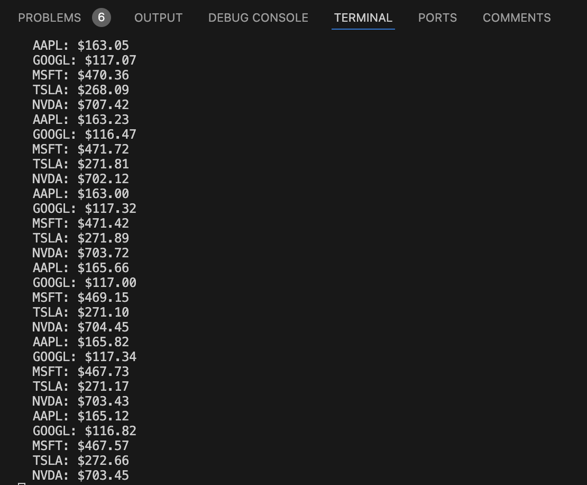
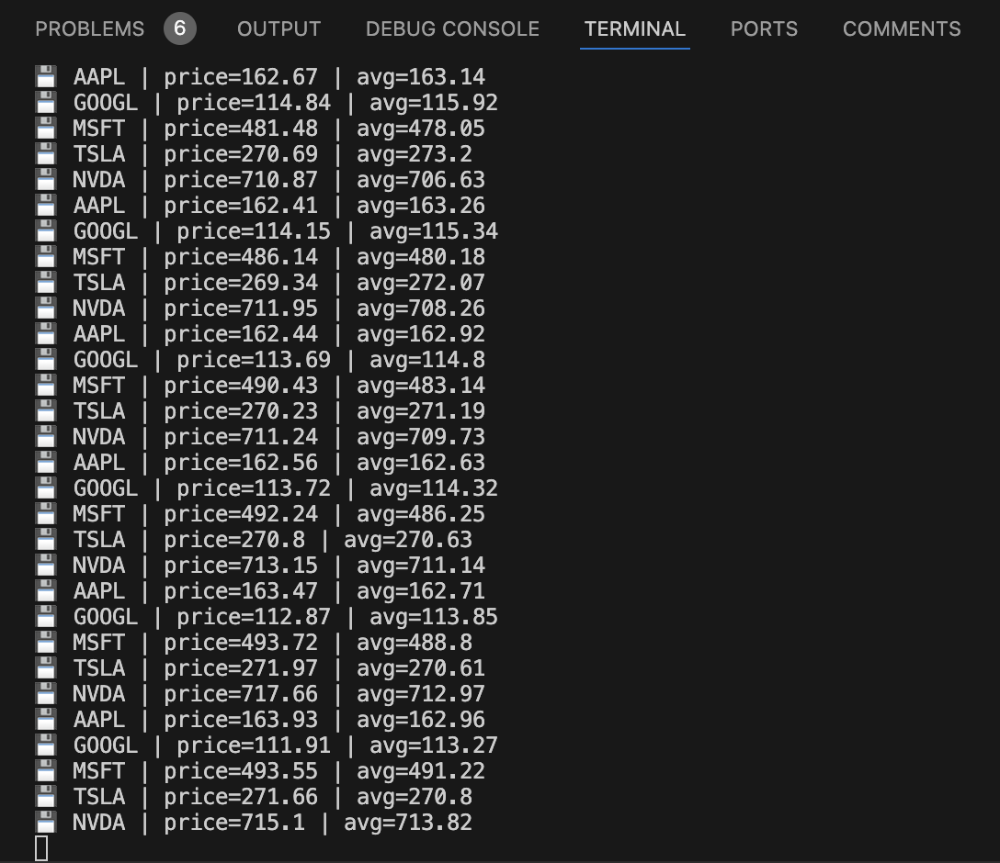
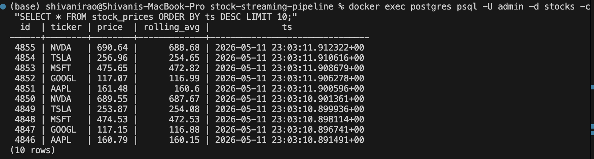
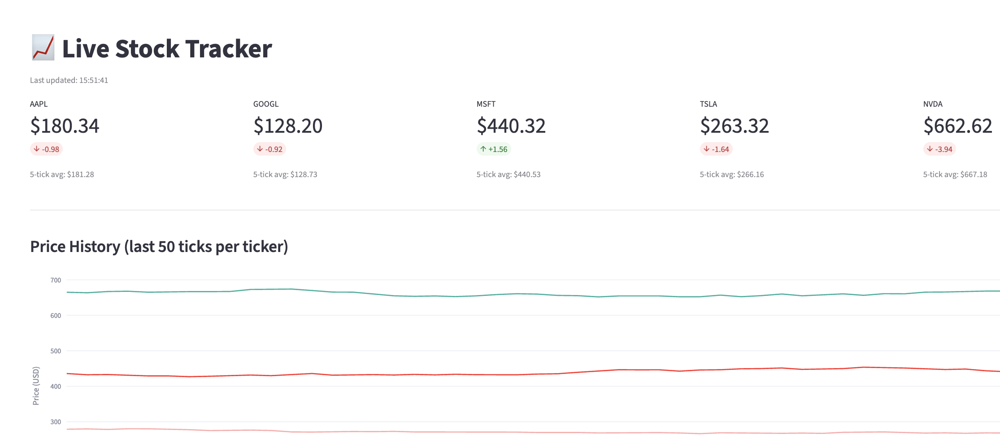

# 📡 Real-Time Stock Streaming Pipeline

> End-to-end streaming data pipeline — from Kafka ingestion to live visualization — built entirely in Python with async processing and containerized infrastructure.


https://github.com/user-attachments/assets/c0c68a32-b059-4e69-929e-708616c8ac82


---

## 🏗️ Architecture

```
┌─────────────────────────────────────────────────────────────────┐
│                    PRODUCER (Python)                            │
│  Random-walk prices · 5 tickers · 1 event/sec/ticker           │
│  AAPL  GOOGL  MSFT  TSLA  NVDA                                  │
└─────────────────────┬───────────────────────────────────────────┘
                      │  JSON over TCP
                      ▼
┌─────────────────────────────────────────────────────────────────┐
│                 APACHE KAFKA (Docker)                           │
│  Topic: stock-prices  ·  KRaft mode (no Zookeeper)             │
│  Auto-create topics  ·  Port 9092                               │
└─────────────────────┬───────────────────────────────────────────┘
                      │  aiokafka async consumer
                      ▼
┌─────────────────────────────────────────────────────────────────┐
│              STREAM PROCESSOR (async Python)                    │
│  Consumes Kafka topic  ·  5-tick rolling average per ticker     │
│  Non-blocking writes via asyncpg                                │
└─────────────────────┬───────────────────────────────────────────┘
                      │  INSERT (asyncpg)
                      ▼
┌─────────────────────────────────────────────────────────────────┐
│               POSTGRESQL 15 (Docker)                            │
│  Table: stock_prices  ·  Indexed on (ticker, ts DESC)          │
│  DB: stocks  ·  Port 5432                                       │
└─────────────────────┬───────────────────────────────────────────┘
                      │  psycopg2 + pandas
                      ▼
┌─────────────────────────────────────────────────────────────────┐
│           STREAMLIT DASHBOARD (Python)                          │
│  Live price metrics  ·  Delta indicators  ·  Plotly chart      │
│  Auto-refresh every 3s  ·  http://localhost:8501               │
└─────────────────────────────────────────────────────────────────┘
```

---

## ⚡ Quickstart

### Prerequisites

- Docker Desktop (≥ v4.x)
- Python 3.10+
- ~2GB free disk space for Docker images

### 1. Clone & Enter

```bash
git clone https://github.com/AbhignaVKumar/stock-streaming-pipeline.git
cd stock-streaming-pipeline
```

### 2. Start Infrastructure

```bash
docker compose up -d
docker compose ps   # verify kafka and postgres are running
```

### 3. Apply Database Schema

```bash
docker exec -i postgres psql -U admin -d stocks < init.sql
```

### 4. Install Python Dependencies

```bash
pip install kafka-python-ng aiokafka asyncpg psycopg2-binary streamlit plotly pandas
```

### 5. Run the Pipeline (3 terminals)

```bash
# Terminal 1 — Producer
python producer/producer.py

# Terminal 2 — Stream Processor
python processor/app.py

# Terminal 3 — Dashboard
streamlit run dashboard/app.py
```

Open **http://localhost:8501** 🚀

---

## 📁 Project Structure

```
stock-streaming-pipeline/
├── docker-compose.yml          # Kafka (KRaft) + PostgreSQL
├── init.sql                    # Schema: stock_prices table + index
├── requirements.txt
├── producer/
│   └── producer.py             # Kafka producer — mock stock prices
├── processor/
│   └── app.py                  # Async Kafka consumer + DB writer
└── dashboard/
    └── app.py                  # Streamlit live dashboard
```

---

## 🔧 Component Deep Dive

### Producer

Simulates realistic stock prices using a **random walk model** (±0.5% per tick), publishing one event per ticker per second — **5 events/sec total** to the `stock-prices` Kafka topic.

```json
{ "ticker": "AAPL", "price": 174.38, "ts": "2026-05-11T15:52:48.123Z" }
```

Includes retry logic: reconnects to Kafka every 5s for up to 60s on startup failure.



---

### Stream Processor

Async consumer using **aiokafka** running in a single non-blocking event loop. Maintains an **in-memory sliding window** (last 5 prices) per ticker, computes the rolling average, then writes to PostgreSQL via **asyncpg** — no thread blocking, no stalled consumption.



The processed rows land in PostgreSQL immediately:



---

### Dashboard

Streamlit app at **http://localhost:8501**, auto-refreshing every 3 seconds via `st.rerun()`. Shows per-ticker price metrics with green/red delta indicators and 5-tick rolling averages, plus a Plotly time-series chart of the last 50 ticks across all tickers.



Live in action:

<!-- INSERT: Screen recording (GIF or MP4) of the dashboard — prices ticking, deltas flipping green/red, chart updating in real time -->

---

## 🛠️ Tech Stack

| Layer | Technology | Why |
|---|---|---|
| Message Broker | Apache Kafka (KRaft) | Industry-standard streaming; KRaft removes Zookeeper complexity |
| Producer | kafka-python-ng | Maintained Python 3.12-compatible Kafka client |
| Stream Processor | aiokafka | Async-native Kafka consumer, no thread overhead |
| Database Driver | asyncpg | Fastest async PostgreSQL driver for Python |
| Database | PostgreSQL 15 | Reliable, indexed time-series storage |
| Dashboard | Streamlit + Plotly | Rapid real-time visualization in pure Python |
| Infrastructure | Docker Compose | Reproducible single-command environment setup |

---

## 🎯 Key Design Decisions

**KRaft over Zookeeper** — Apache Kafka 3.x supports KRaft consensus, eliminating the need for a separate Zookeeper container. This simplifies Docker Compose from 3 services to 2 and removes an entire failure surface.

**aiokafka over Faust** — `faust-streaming` has build failures on Python 3.12 due to setuptools incompatibilities. `aiokafka` is the underlying async Kafka driver that Faust itself uses — going direct removes the abstraction layer and is more stable.

**asyncpg for DB writes** — The processor runs in a single async event loop. Using `asyncpg` (vs `psycopg2`) keeps DB writes non-blocking, meaning Kafka message consumption is never stalled waiting for a DB response.

**In-memory rolling window** — Rather than computing rolling averages with a SQL window function on every insert, we maintain a per-ticker deque in application memory. This is O(1) per message and avoids a round-trip query per write.

---

## 🚀 Potential Extensions

| Extension | Description |
|---|---|
| **Schema Registry + Avro** | Enforce message contracts between producer and consumer |
| **Grafana Dashboard** | Replace Streamlit with production-grade Grafana + postgres datasource |
| **AWS Deployment** | Kafka → AWS MSK, Postgres → RDS, Dashboard → EC2/ECS |
| **Dead Letter Queue** | Route failed messages to `stock-prices-dlq` topic with error metadata |
| **Consumer Lag Monitoring** | Prometheus + alerting on Kafka consumer group lag |
| **Multi-window Aggregations** | 1-min, 5-min, 15-min VWAP alongside tick-level rolling avg |
| **Real Market Data** | Swap mock generator for Yahoo Finance (`yfinance`) or Alpaca API |

---

## 🧹 Teardown

```bash
docker compose down -v
```

---

## 📄 License

MIT
